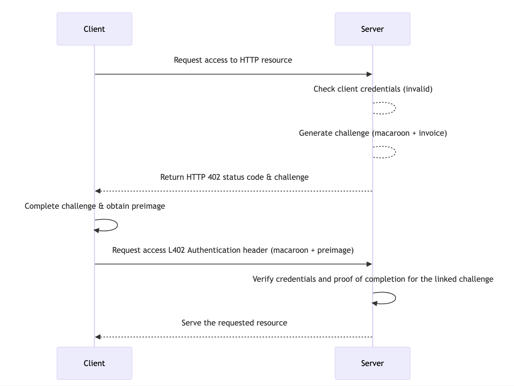

---

# What is L402? (Simply Put)

L402 is a protocol that lets you:
- **Pay for APIs** with Bitcoin Lightning ⚡
- **Use services instantly** without creating accounts
- **Pay only for what you use** (micropayments)

Think of it as a **digital vending machine** for web services

---

# The L402 Flow



1. **Request access** to an API
2. **Receive an invoice** + authentication token
3. **Pay the invoice** with Lightning
4. **Use the API** with your payment proof

---

# Core Components

1. **HTTP 402**: "Payment Required" status code
2. **Lightning Network**: For fast, small Bitcoin payments
3. **Macaroons**: Special authentication tokens
4. **Preimage**: Proof of payment

No accounts, No credit cards, No subscription

---

# L402 Headers

Request access headers:
- **WWW-Authenticate**: `L402 token="{hash}"`
- **L402-Invoice**: `lnbc500...` 
- **L402-Macaroon**: `abc123...`

Access headers:
- **Authorization**: `L402 {preimage}`
- **L402-Macaroon**: `abc123...`

---

# PART 2: BUILD AN L402 SERVER (STEP BY STEP)

---

# Try It Out!

The complete demo is available at:

- **Live Demo**: [https://replit.com/@voltage-cloud/L402-demo-server](https://replit.com/@voltage-cloud/L402-demo-server)
- **Source Code**: [https://github.com/austinkelsay/L402-demo-server](https://github.com/austinkelsay/L402-demo-server)

Feel free to fork and experiment!

---

# Project Setup - What We'll Build

- Express.js server with L402 authentication
- LND connection for Creating and Verifying Invoices
- Two endpoints:
  - `/api/request-access` - Get invoice & token
  - `/api/protected-data` - Access with L402 auth

---

# Step 1: Project Structure

```
L402-demo-server/
  ├── index.js        // Main server
  ├── lnd.js          // Lightning connection
  ├── sample_data.json // Demo data
  └── .env            // LND credentials
```

```bash
# Initialize and install dependencies
npm init -y
npm install express axios dotenv
```

---

Sample Data Structure (sample_data.json)
```json
{
  "products": [
    {
      "id": 1,
      "name": "Premium API Access",
      "description": "24-hour access to premium endpoints",
      "price": 1000
    },
    {
      "id": 2,
      "name": "Basic API Access",
      "description": "24-hour access to basic endpoints",
      "price": 500
    }
  ],
  "protected_data": [
    {
      "id": 1,
      "content": "This is some premium protected content"
    },
    {
      "id": 2,
      "content": "This is more premium protected content"
    }
  ]
}
```
---

## Step 2: LND Connection (lnd.js)

```javascript
// First, set up the LND connection
const axios = require("axios");
const dotenv = require("dotenv");
dotenv.config();

// LND connection parameters
const MACAROON = process.env.MACAROON;
const HOST = process.env.HOST;

// Create axios instance for LND API calls
const lnd = axios.create({
   baseURL: `https://${HOST}:8080`,
   headers: {
      "Content-Type": "application/json",
      "Grpc-Metadata-Macaroon": MACAROON,
   },
});
```

---

## Step 3: Invoice Functions (lnd.js)

```javascript
// Add function to create Lightning invoices
const addInvoice = async (amount) => {
   try {
      const response = await lnd.post("/v1/invoices", {
         value: amount,
      });
      return response.data;
   } catch (error) {
      console.error("Error creating invoice:", error);
      throw error;
   }
};

// Add function to check if invoice is paid
const lookupInvoice = async (rHashStr) => {
   try {
      const response = await lnd.get(`/v1/invoice/${rHashStr}`);
      return response.data;
   } catch (error) {
      console.error("Error looking up invoice:", error);
      throw error;
   }
};
```

---

## Step 4: Server Setup (index.js)

```javascript
const express = require('express');
const crypto = require('crypto');
const app = express();
const port = 3000;
const sampleData = require('./sample_data.json');
const { addInvoice, lookupInvoice } = require('./lnd.js');

// Storage for our macaroons and payments
const macaroonStore = new Map();
const preimageStore = new Map();

// Parse JSON requests
app.use(express.json());
```

---

### Step 5: Helper Functions (index.js)

```javascript
// Generate Lightning invoice
async function generateInvoice(amount) {
    const invoiceResponse = await addInvoice(amount);
    const paymentHash = invoiceResponse.r_hash;
    preimageStore.set(paymentHash, null); // Will update when paid
    return {
        paymentHash,
        invoice: invoiceResponse.payment_request,
    };
}

// Generate simple macaroon token
function generateMacaroon(paymentHash) {
    const macaroon = crypto.randomBytes(32).toString('hex');
    macaroonStore.set(macaroon, paymentHash);
    return macaroon;
}
```

---

### Step 6: Payment Verification (index.js)

```javascript
// Check if invoice has been paid
async function verifyPayment(paymentHash) {
    try {
        const invoice = await lookupInvoice(paymentHash);
        if (invoice.settled) {
            // Store payment preimage
            preimageStore.set(paymentHash, invoice.r_preimage);
            return true;
        }
        return false;
    } catch (error) {
        console.error('Error verifying payment:', error);
        return false;
    }
}

// Verify L402 credentials
async function verifyL402(preimage, macaroon) {
    const paymentHash = macaroonStore.get(macaroon);
    if (!paymentHash) return false;
    
    // Check payment status
    const isPaymentSettled = await verifyPayment(paymentHash);
    if (!isPaymentSettled) return false;

    // Verify preimage matches
    const storedPreimage = preimageStore.get(paymentHash);
    const storedPreimageHex = Buffer.from(storedPreimage, 'base64').toString('hex');
    return storedPreimageHex === preimage;
}
```

---

### Step 7: L402 Auth Middleware (index.js)

```javascript
// Middleware to check L402 authentication
const checkL402Auth = async (req, res, next) => {
    const authHeader = req.headers['authorization'];
    const macaroon = req.headers['l402-macaroon'];
    
    if (!authHeader || !macaroon) {
        return res.status(402).json({
            message: 'Payment Required',
            headers: {
                'WWW-Authenticate': 'L402',
                'L402-Invoice': 'Required',
                'L402-Macaroon': 'Required'
            }
        });
    }

    // Extract preimage from Authorization header
    const [scheme, preimage] = authHeader.split(' ');
    if (scheme !== 'L402') {
        return res.status(401).json({ message: 'Invalid authorization scheme' });
    }

    // Verify the credentials
    const isValid = await verifyL402(preimage, macaroon);
    if (!isValid) {
        return res.status(401).json({ message: 'Invalid L402 credentials' });
    }
    
    next(); // Proceed to protected endpoint
}
```

---

#### Step 8: Request Access Endpoint (index.js)

```javascript
// Endpoint to request L402 access
app.post('/api/request-access', async (req, res) => {
    try {
        const { productId } = req.body;
        const product = sampleData.products.find(p => p.id === productId);
        
        if (!product) {
            return res.status(404).json({ message: 'Product not found' });
        }

        // Generate invoice and macaroon
        const { paymentHash, invoice } = await generateInvoice(product.price);
        const macaroon = generateMacaroon(paymentHash);

        // Return L402 headers
        res.status(402).json({
            message: 'Payment required',
            headers: {
                'WWW-Authenticate': `L402 token="${paymentHash}"`,
                'L402-Invoice': invoice,
                'L402-Macaroon': macaroon
            }
        });
    } catch (error) {
        res.status(500).json({ message: 'Internal server error' });
    }
});
```

---

### Step 9: Protected Endpoint (index.js)

```javascript
// Protected route with L402 authentication
app.get('/api/protected-data', checkL402Auth, (req, res) => {
    res.json({
        success: true,
        data: sampleData.protected_data
    });
});

// Start the server
app.listen(port, () => {
    console.log(`L402 demo server running on port ${port}`);
});
```

---

# PART 3: TESTING THE SERVER

---

## Setup for Testing

1. Create `.env` file with LND credentials:
   ```
   MACAROON=your_lnd_admin_macaroon
   HOST=your_lnd_host
   ```

2. Create `sample_data.json`:
   ```json
   {
     "products": [
       {"id": 1, "name": "Premium API Access", "description": "24-hour access to premium endpoints", "price": 1000},
       {"id": 2, "name": "Basic API Access", "description": "24-hour access to basic endpoints", "price": 500}
     ],
     "protected_data": [
       {"id": 1, "content": "This is premium content!"},
       {"id": 2, "content": "This is more premium content!"}
     ]
   }
   ```

3. Start server: `node index.js`

---

### Test Step 1: Request Access

Using curl:
```bash
curl -X POST http://localhost:3000/api/request-access \
  -H "Content-Type: application/json" \
  -d '{"productId": 1}'
```

Expected response:
```json
{
  "message": "Payment required",
  "headers": {
    "WWW-Authenticate": "L402 token=\"abc123...\"",
    "L402-Invoice": "lnbc500n1...",
    "L402-Macaroon": "def456..."
  }
}
```

---

## Test Step 2: Pay the Invoice

1. Copy the `L402-Invoice` value 
2. Pay it using any Lightning wallet
3. Save the `preimage` and `macaroon` values

The payment is processed automatically by LND

---

## Test Step 3: Access Protected Data

Using curl with your credentials:
```bash
curl http://localhost:3000/api/protected-data \
  -H "Authorization: L402 <preimage>" \
  -H "L402-Macaroon: <macaroon>"
```

Expected response:
```json
{
  "success": true,
  "data": {
    "message": "This is premium content!"
  }
}
```

Note: Replace `<preimage>` with the payment preimage and `<macaroon>` with the value from step 1

---

## Complete L402 Flow Review

1. **Client** requests access and specifies product
2. **Server** creates invoice and macaroon token
3. **Client** pays invoice with Lightning
4. **Client** uses preimage + macaroon to authenticate
5. **Server** verifies credentials without payment lookup
6. **Server** returns protected data

---

## Practical Uses for L402

- **AI API access** - Pay per query/request
- **Content paywalls** - Articles, videos, downloads
- **Data services** - Weather, financial, specialized info
- **Rate limiting** - Natural spam prevention
- **Anonymous access** - No account needed

---

# Resources

- [L402 Protocol Spec](https://docs.lightning.engineering/the-lightning-network/l402)
- [LND API Documentation](https://lightning.engineering/api-docs/api/lnd/)
- This project code: [L402-demo-server](https://github.com/austinkelsay/L402-demo-server)
- [L402-demo-server Replit](https://replit.com/@voltage-cloud/L402-demo-server)

---

# Thank You!

Questions?


